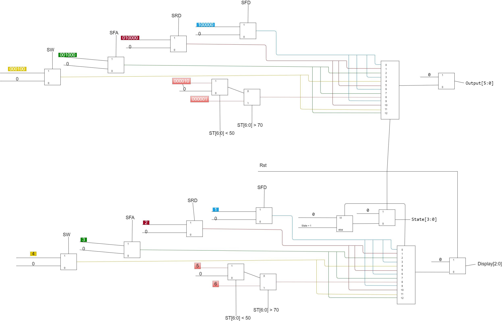
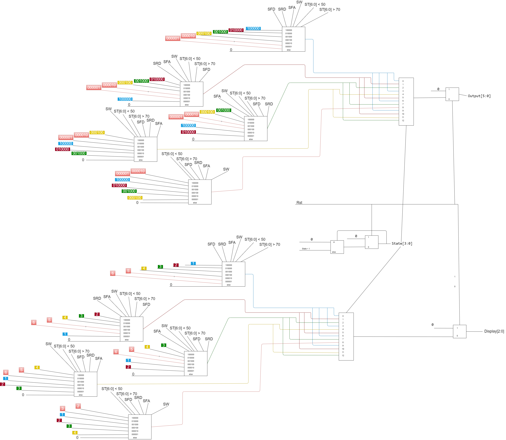
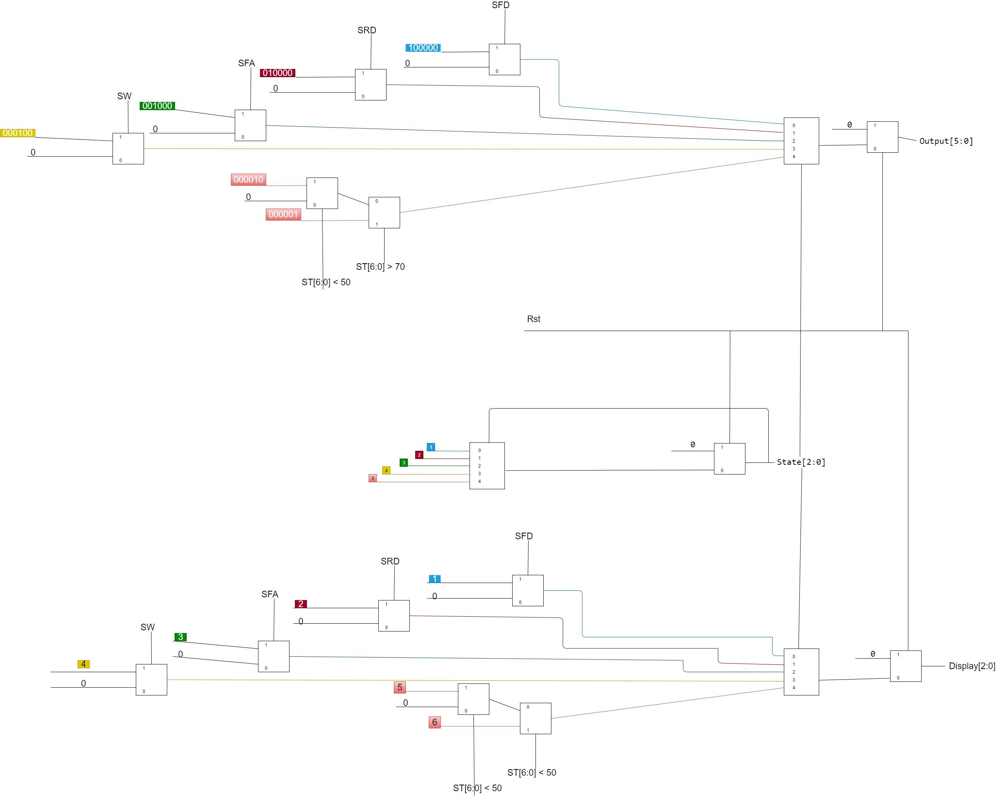

<h1 align="center">
  Home-Automation-System
</h1>

# Overview

This is a VLSI project where we used Synthesis, Placing & Routing on our hardware designs to achieve best performance for the given requirements.

### Problem specification

Home automation involves a number of factors including:
• **Security**: where the system is concerned with home intrusion detection
and avoidance.
• **Environment factors**: such as temperature and fire detection.

The system is designed to control the doors, windows, fire alarm and the temperature. Each process being automated is associated with a sensor.

• When the sensor is `LOW (0)` then no action is needed, and the next
device can be checked.
• When the sensor is `HIGH (1)` then an action is needed.

Sensors include:

1. Front door
2. Rear door
3. Fire alarm
4. Window
5. Temperature

# Setup

> ### clone this repository with

```bash
https://github.com/We2Am-BaSsem/Home-Automation-System.git
```

> ### create new project with Modelsim in the same directory with ProjectName "Home-Automation-System" to create the work folder and mpf file.

```bash
Home-Automation-System
```

> ### Then add existing files to add VHDL or Verilog files to your local project
>
> #### unfortunately, You need to do this countinousley when you pull from the remote repository

# Solution

We worked on 4 different designs with resonable assumptions to solve this problem. Below is a brief description of them followed by the results:

### 13 States Mono



Rather than checking the sensors on each cycle based on their priority, we check the sensors on 13 cycles, with each sensor having a higher weight based on its priority, so:

1. The front sensor has 4 cycles weight.
2. The rear sensor have 3 cycles weight.
3. The fire sensor have 3 cycles weight.
4. The window sensor have 2 cycles weight.
5. The temperature sensor have 1 cycles weight.

This means that the front door sensor is checked four times for every 13 clock cycles, while the rear door and fire alarm sensors are checked three times for every 13 clock cycles, and so on.

### 13 States Multi



The goal of this design is to make the 13 States Mono more effective by not just checking one sensor on each clock cycle based on its weight, but also monitoring the other sensors if a sensor's reading is low on his turn.

### Design 14253


This design utilizes two loops, the inner one loops every single cycle on all sensors until it finds a `HIGH` signal to process, while the other one decides the beginning of the inner loop, i.e.:
the inner loop can be one of 5:

```
1 2 3 4 5
2 3 4 5 1
3 4 5 1 2
4 5 1 2 3
5 1 2 3 4
```

the outer loop decides which one.
In another way, the outer loop selects where to start checking, then the inner loop stops when it finds a `HIGH` signal or outputs `ZERO` if none is found. The trick is, the Start of checking is `1, 4, 2, 5, 3` instead of the usual `1, 2, 3, 4, 5.` This distributes the checked signals more evenly compared to the naive way. In a third way, this design checks signals like this:

1. first cycle: `1->2->3->4->5`.
2. next: `4->5->1->2->3`.
3. next: `2->.....`.
4. next `5...`.
5. next `3...`.
6. go back to `1`.

### Seq mono check



We examine the reading of one sensor every clock cycle, starting with the greatest priority and working our way down, therefore we need 6 clock cycles to check the full system design. When it's time to check a sensor with a lower priority than the previous one and a high value, we ignore the previous one and update the display with the current condition, despite the lower priority.
